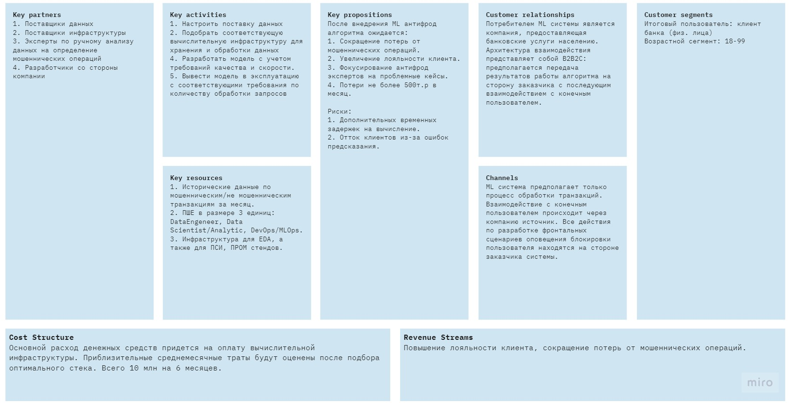
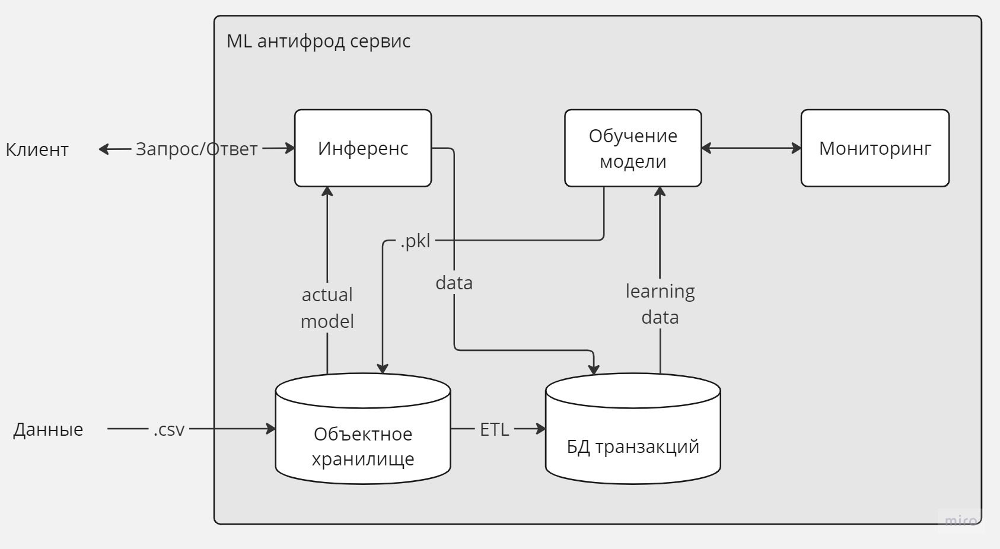

# Система определения мошеннических финансовых операций

## Общее описание
### Цели проекта
Необходимо реализовать ML антифрод систему, которая позволила бы определить мошеннические транзакции компании, которая предоставляет банковские услуги населению. Система должна сократить количество мошеннических операций, но также должна быть сбалансированной в сторону оценки положительных транзакций.  
### Сроки
MVP необходимо представить через 3 месяца после начала реализации. Полный срок реализации проекта - 6 месяцев, при условии, что продукт будет одобрен руководством при первичной оценке.
### Бюджет
10 млн. на реализацию без учета затрат на специалистов. 
### Нагрузка
50 транзакций в секунду (тр/с) в обычный день. Пик - 400тр/с перед праздниками. 
### Ресурсы
Вычислительные ресурсы необходимо подобрать самостоятельно, компания не предоставляет инфраструктуру.
### Безопасность
В данных транзакций есть персональные данные, поэтому утечка несет большие репутационные риски.

## Метрики
### Бизнес метрики
Из информации о партнерах известно, что доля мошеннических операций не должна превышать 2%, и суммарные потери от этих транзакций не должны превышать 500т.р. Количество ложно определенных мошеннических операций не должна превышать 5%. 
### DS метрики
Считаем, что класс **Positive** отностится к мошенническим транзакциям. Их должно быть не больше 2% от общего количества транзакций. Класс **Negative** - обычные транзакции, ошибка в котороых не должна превышать 5%.\
Представим, что есть 100 транзакций. Возьмем крайний случай, когда мы не определили ни одной из двух мошеннических транзакций. Также, добавим ошибку в определении клиентских транзакций - 5шт. 
Крайний допустимый случай:
| |Предсказанные нормальные операции|Предсказанные мошеннические операции|
|----------------------|--------------------|---------------------|
|**Нормальные операции**|TP - 93|FP - 5|
|**Мошеннические операции**|FN - 2|TN - 0|

Получаем следующие значения:
* `Precision >= 0.949` - TP / (TP + FP) ошибка 1 рода
* `Recal >= 0.979` - TP / (TP + FN) ошибка 2 рода
* => `F1-score >= 0.969` - среднегармоническое между точностью и полнотой

## Mission Model Canvas

## Декомпозиция системы

