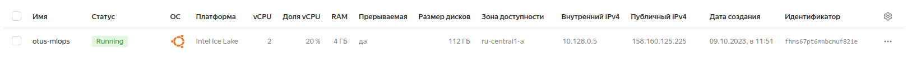
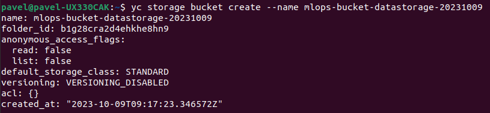
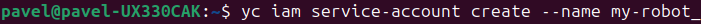
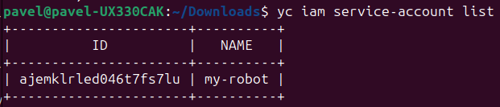
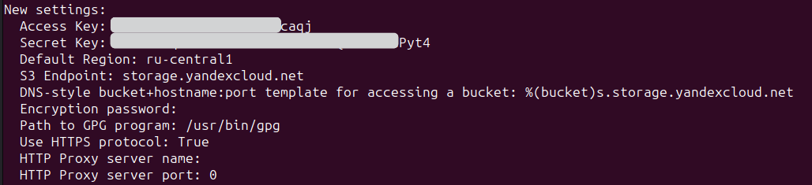
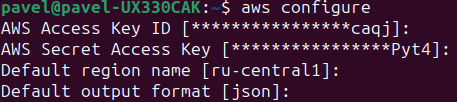
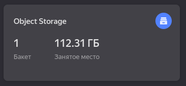
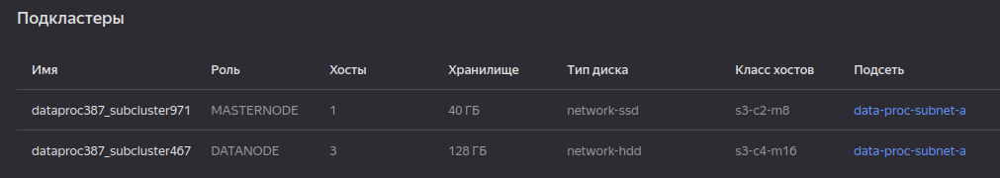
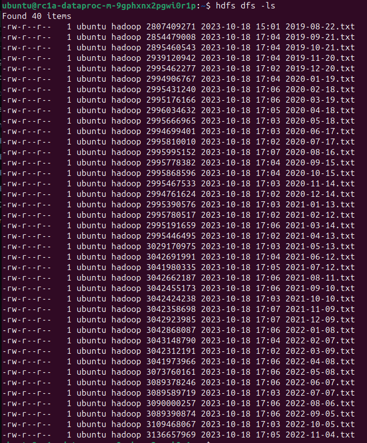
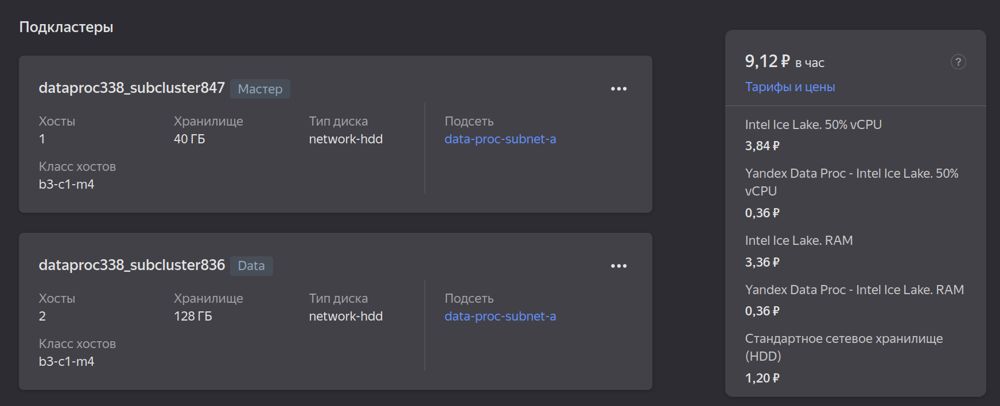

# Практическая работа #2

## Цель:
Начать работу с Yandex Cloud, поработать с сервисами Object Storage и Data Proc, создать свой Spark-кластер и скопировать в него данные, оценить затраты при проектировании облачной инфраструктуры.\

## Cоздание ВМ и Object Storage
Проектируемая система должна содержать в себе вычислительную инфраструктуру, которая располагается на кластере Yandex Cloud. Изначально необходимо подобрать ВМ с учетом EDA. Машина должна содержать в себе достаточное количество CPU (например 4 ядра Indel Ice Lake), большой объем RAM (64гб и больше) и видеокарта (желательно Tasla V100/Tesla A100, но можно и более легкие конфигурации, доступные в YC).Размер основного хранилища не принципиален (основное хранилище - объектное, из него можно получить срезы данных), но для локального хранения отдельных датафреймов и витрин можно заказать на 1тб.\ 
Замечу, что на промышленном стенде использование ресурсов откорректируется в зависимости от выбранного решения.\

**!!С точки зрения экономии ресурсов и в рамках учебного процесса на данном этапе ВМ была заказана с другой конфигурацией!!** 

## Копирование данных
### Создание бакета
Создаем объектное хранилище, предварительно настроив доступ к Yandex Cloud через CLI (инструкция: https://cloud.yandex.ru/docs/cli/).


### Сервисный аккаунт
Создаем сервисный аккаунт `my-robot`



Назначем роль администратора `--role admin` сервисному аккаунту и получаем для него **access-key** командой:\
`yc iam access-key create --service-account-name my-robot`


### Загрузка данных
Для копирования данных из публичного бакета otus: `s3://mlops-data/fraud-data/` необходимо настроить иснтрумент s3cmd и произвести копирование через команду `s3cmd sync`. Однаков в моем случае даже при верно настроенной конфигурации s3 с данными сервисного аккаунта копирование не производилось. Поэтому был выбран альтернативный иснтрумент **AWS CLI**. Настройка:

Копирование происходит командой `aws --endpoint-url=https://storage.yandexcloud.net s3 cp s3://mlops-data/fraud-data/ s3://mlops-bucket-datastorage-20231009 --copy-props none --recursive` где отдельным ключем передается необходим для YC endpint-url. \
После синхронизации получаем данные в личном Object Storage бакете:



```
s3://mlops-bucket-datastorage-20231009
```

## Создание кластера Spark-кластера
Создаем в Data Proc Spark-кластер со следующими параметрами:
1. Мастер-подкластер: класс хоста s3-c2-m8, размер хранилища 40 ГБ.
2. Data-подкластер: класс хоста s3-c4-m16, 3 хоста, размер хранилища 128 ГБ.



Подключаемся к мастер-подкластеру по ssh поизводим копирование файлов в корневую директорию командой:

`hadoop distcp s3a://mlops-bucket-datastorage-20231009/* ./`

Результат копирования:



## Сокращение расходов на Spark-кластер
Текущая стоимость: **~36р/час** \
Сократить стоимость кластера мозно за счет оптимизации подкластеров и сокращения числа хостов.
На данном этапе больше половины **data** подкластера пустует. Поэтому можно сократить количество хостов до **2**.
Сделаем кластера с типом диска **network-hdd**, а также сократим стабильную доступность дисков до класса хостов **burstable**. Итоговая стоимость:


Примерное сокращение расходов: 75\%
