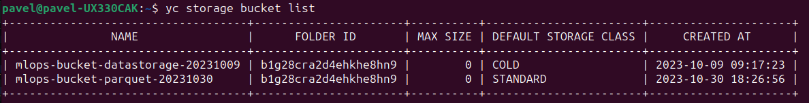
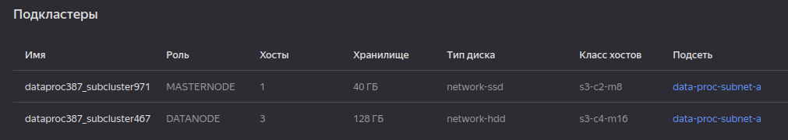

# Практическая работа #3

## Цель:
Обработать собранные датасеты, посмотреть на аномалии в датасете и произвести очистку. После обработки сохранить в виде .parquet файлов в новом Object Storage. \

## Cоздание ВМ и Object Storage
Создаем новое объектное хранилище с названием `mlops-bucket-parquet-20231030` для сохранение обрабтанных .parquet файлов. Создается также как и в практической работе #2.



Ссылка на бакет: 
```
s3://mlops-bucket-parquet-20231030
```

## Создание кластера Spark-кластера
Создаем в Data Proc Spark-кластер со следующими параметрами:
1. Мастер-подкластер: класс хоста s3-c2-m8, размер хранилища 40 ГБ.
2. Data-подкластер: класс хоста s3-c4-m16, 3 хоста, размер хранилища 128 ГБ.



Подключаемся к мастер-подкластеру по ssh поизводим копирование файлов в корневую директорию командой:

`hadoop distcp s3a://mlops-bucket-datastorage-20231009/* ./`

## Подключение
Подключаемся к мастер хосту кластера по внешнему ip. На кластере запускаем Jupyter Notebook. Для того, чтобы зайти с локальной машины на Jupter Notebook кластера необходмо скопировать ссылку на доступ и заменить localhost на ip нашего мастер хоста. Предварительно надо в настройках группы безопасности открыть порт 8888.

## Очистка данных
Чтение и очиска данных осуществляется через PySpark. Файлы берутся из HDFS хранилища, обрабатываются и сохраняются сразу в бакет **mlops-bucket-parquet-20231030**. Применные методы валидации данных:
1. Валидация типов, по схеме создания Spark сессии
2. Поиск и удаление пропущенных значений
3. Удаление дубликатов по уникальному полю **transaction_id**

Вся остальная информация представлена в **process_data.ipynb** файле обработки данных.


```python

```
